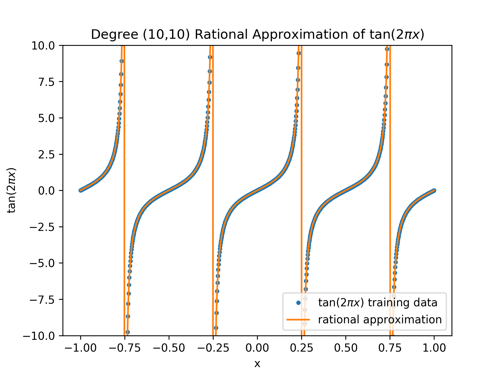

# PolyRat: Polynomial and Rational Function Library

[](https://badge.fury.io/py/polyrat)
[](https://github.com/jeffrey-hokanson/polyrat/actions?query=workflow%3ACI)
[](https://coveralls.io/github/jeffrey-hokanson/polyrat?branch=master)
[](https://polyrat.readthedocs.io/en/latest/?badge=latest)

PolyRat is a library for polynomial and rational approximation.
Formally we can think of [polynomials](https://en.wikipedia.org/wiki/Polynomial#Polynomial_functions) as a sum of powers of :


A [rational function](https://en.wikipedia.org/wiki/Rational_function) is a ratio of two polynomial functions


The goal of this library is to construct polynomial and rational approximations
given a collection of point data consisting of pairs of 
inputs 
and outputs 
that minimizes (for example)


The ultimate goal of this library is to provide algorithms to construct these approximations
in a variety of norms with a variety of constraints on the approximants.


The **polynomial approximation** problem is relatively straightfoward
as it is a convex problem for any [p-norm](https://en.wikipedia.org/wiki/Norm_(mathematics)#p-norm) with p≥1.
However, there is still a need to be careful 
in the construction of the polynomial basis for high-degree polynomials
to avoid ill-conditioning.
Here we provide access to a number of polynomial bases:

* tensor-product polynomials based on Numpy (e.g., Monomial, Legendre, etc.);
* [Vandermonde with Arnoldi](https://arxiv.org/abs/1911.09988) polynomial basis;
* [barycentric Lagrange](https://doi.org/10.1137/S0036144502417715) polynomial bases.

The **rational approximation** problem is still an open research problem.
This library provides a variety of algorithms for constructing rational approximations
including:

* [Adaptive Anderson Antoulas](https://doi.org/10.1137/16M1106122)
* [Sanathanan Koerner iteration](https://doi.org/10.1109/TAC.1963.1105517)
* [Stabilized Sanathanan Koerner iteration](https://arxiv.org/abs/2009.10803)
* [Vector Fitting](https://doi.org/10.1109/61.772353)


## Installation

    > pip install --upgrade polyrat


## Documentation

[Full documentation](https://polyrat.readthedocs.io/en/latest/index.html) is hosted on Read the Docs.


## Usage

Using PolyRat follows the general pattern of [scikit-learn](https://scikit-learn.org/stable/).
For example, to construct a rational approximation of the tangent function

```python
import numpy as np
import polyrat

x = np.linspace(-1,1, 1000).reshape(-1,1)  # Input data 🚨 must be 2-dimensional
y = np.tan(2*np.pi*x.flatten())            # Output data

num_degree, denom_degree = 10, 10          # numerator and denominator degrees 
rat = polyrat.StabilizedSKRationalApproximation(num_degree, denom_degree)
rat.fit(x, y)
```

After constructing this approximation, we can then evaluate 
the resulting approximation by calling the class-instance

```python
y_approx = rat(x)		# Evaluate the rational approximation on X
```

Comparing this to training data, we note
that this degree-(10,10) approximation is highly accurate 
<p align="center">

</p>


## Reproducibility

This repository contains the code to reproduce the figures in the associated papers

* [Multivariate Rational Approximation Using a Stabilized Sanathanan-Koerner Iteration](https://arxiv.org/abs/2009.10803)
  in [Reproducibility/Stabilized_SK](Reproducibility/Stabilized_SK)


## Related Projects

* [baryrat](https://github.com/c-f-h/baryrat): Pure python implementation of the AAA algorithm
* [Block-AAA](https://github.com/nla-group/block_aaa): Matlab implementation of a matrix-valued AAA variant
* [RationalApproximations](https://github.com/billmclean/RationalApproximations): Julia implementation AAA variants
* [RatRemez](https://github.com/sfilip/ratremez) Rational Remez algorithm (Silviu-Ioan Filip)
* [BarycentricDC](https://github.com/sfilip/barycentricDC) Barycentric Differential Correction (see [SISC paper](https://doi.org/10.1137/17M1132409))


